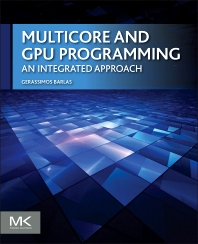
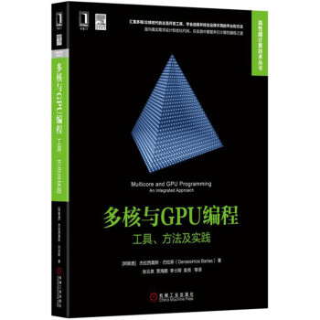

# Multicore and GPU Programming

The code(v1.03) in this package accompanies the book:

"***Multicore and GPU Programming: An Integrated Approach***", by Gerassimos Barlas, 1e, Morgan Kaufmann, 2014, ISBN-13: 978-0124171374

* [Elsevier booksite](http://booksite.elsevier.com/9780124171374/index.php)

-----

## Books

   

## Declaration

All the code is offered as free software: you can redistribute it and/or modify it under the terms of the GNU General Public License as published by the Free Software Foundation, either version 3 of the License, or (at your option) any later version.

The code is distributed in the hope that it will be useful, but WITHOUT ANY WARRANTY; without even the implied warranty of MERCHANTABILITY or FITNESS FOR A PARTICULAR PURPOSE.  See the GNU General Public License for more details.
